# StackVisualizer
スタックの状態を図示するpython3プログラム

スタック志向プログラミング言語の解説用に製作しました（誰得）。

## デモ
スタックの状態を記述したテキストファイルを作ります。

```
[1,2,3
E
```

これを「sample001.txt」という名前で保存し、stackVisualizer.pyを実行します。

```
python3 ./stackVisualizer.py sample001.txt
```

以下の画像が出力されます。

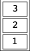

## 特徴

- スタックの状態図を効率よく作成できます。
- 出力画像はSVG（ベクタ）、PNG（ラスタ）の2種類出力されます。

## 必要な環境

バージョンはいずれも検証時のものです。

- python3 (3.9.6)
- 以下のpythonモジュール
  - svgwrite (1.4.1)
  - CairoSVG (2.5.2)

## インストール方法

特別なインストール手続きは不要です。

あえて手順を書くなら以下の通りです。

1. python3をインストールする。
2. pip3 installなどを駆使して、svgwriteとCairoSVGをインストールする。
3. stackVisualizer.pyをお好みのディレクトリに配置する。
4. 実行する。例えば以下のように。
```
python3 ./stackVisualizer.py sample001.txt
```

## 詳細な使い方

stackVisualizer.pyはテキストファイルを1つ引数に取ります。

それ以外のオプションはありません。

オプションに相当するものは上記テキストファイル内に記述します。

## テキストファイルの書き方

テキストファイルは行ごとにスキャンされます。

各行の処理内容は行頭の1文字目によって決定されるため、

行頭に余計な空白文字（スペース・タブなど）があると正しく動作しません。

また、以下では英字の大文字・小文字は区別されます。

### ファイルの末尾 `E`

行頭が`E`の行は、ファイル終端を表します。

これ以降の行は無視されます。

この行は必須ではありませんが、

この行がないと記述通りの挙動とならない場合があります（後述）。

### コメント `%`

行頭が`%`の行は、コメントを表します。

この行の記述内容は無視されます。

なお、行の途中からのコメント指定はできません。

### スタック `[`

行頭が`[`の行に、スタックの中身を記述します。

- スタックの要素はカンマ`,`、セミコロン`;`、または、バーティカルバー`|`で区切ります。
  - `,`は単純な要素の区切りを示します。
  - `;`と`|`は、要素の区切りとグループの区切りを示します（後述）。
- スタックの要素名には、「上記区切り文字と改行文字」以外の任意の文字が使えます。
- 行頭がスタックボトム、行末がスタックトップとなるように、要素を順次記述します。
- ひとつのファイルには、複数のスタックを記述できます。
  - 複数のスタックを記述した場合、各行ごとに別々のファイルが出力されます。

#### グループ
セミコロン`;`とバーティカルバー`|`によって、スタックの要素をグループ分けできます。

たとえば、次の記述では、`a`、`b`、`c`が第一のグループ、

`d`、`e`が第二のグループ、`f`が第三のグループになります。

```
[a,b,c|d,e;f
```

なお、現時点では`;`と`|`の機能に差はありません。

### スタックの属性

以下の文字で始まる行は、スタックの属性を指定します。

スタックの属性は、最後に記述されたスタックに対し、適用されます。

#### 要素の背景色 `P` or `#`

行頭が`P`または`#`の行には、スタック要素の背景色を記述します。

- `#`以降に6桁の16進数を記述すると、その行全体をHTMLコードと見なしたときの色が指定されます。
- `P`以降に以下のいずれかのアルファベット1文字を指定すると、プリセットされた色が指定されます。
  - `w`:白（`#FFFFFF`と等価）
  - `r`:赤（`#FFCFCF`と等価）
  - `y`:黄（`#FFFFCF`と等価）
  - `g`:緑（`#CFFFCF`と等価）
  - `c`:シアン（`#CFFFFF`と等価）
  - `b`:青（`#CFCFFF`と等価）
  - `m`:マゼンタ（`#FFCFFF`と等価）
  - `o`:オレンジ（`#FFCF7F`と等価）
  - `k`:灰（`#CFCFCF`と等価）
- 要素の背景色は、スタック要素のグループごとに適用されます。
  - スタックがグループ分けされていない時は、全要素の背景色を指定できます。
  - スタックがグループ分けされている時は、要素の背景色を複数行にわたって指定します。
    - 背景色の指定は、左端のグループから順に適用されます。
    - グループの数より少なく背景色が指定された場合、指定されなかったグループの背景色はデフォルトの白となります。
    - グループの数より多く背景色が指定された場合、超過分の背景色指定は無視されます。

##### 例

```
[a,b,c|d,e;f
#FF7F7F
Py
E
```

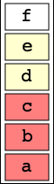

第一グループの`a`、`b`、`c`にはカラーコード`#FF7F7F`が、

第二グループの`d`、`e`にはプリセットの黄色が、

第三グループの`f`には（指定がないため）デフォルトの白が、

それぞれ指定されます。

#### 出力ファイルサフィックス `S`

行頭が`S`の行には、出力ファイルのサフィックスを指定します。

- 行頭の`S`の直後から、サフィックスの文字列を記入します。
- 指定がない場合は、何番目に出力されたかを示す連番がサフィックスとなります。
- 出力ファイル名は「入力されたテキストファイル名+'-'+サフィックス+'.svg'」、または、
「入力されたテキストファイル名+'-'+サフィックス+'.png'」となります。

##### 例
```
[a,b,c,d,e
Sfirst
[f,g,h,i
[j,k,l
S3rd
E
```

このテキストを「sample003.txt」という名前で保存して、以下のコマンドを実行します。

```
python3 stackVisualizer.py sample003.txt
```

この時、1つ目の画像は「sample003.txt-first.svg」（または.png）となります。

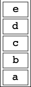

2つ目の画像は（指定がないため、連番の「2」が自動で指定され）

「sample003.txt-2.svg」（または.png）となります。

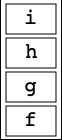

3つ目の画像は「sample003.txt-3rd.svg」（または.png）となります。

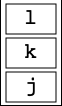

### スタックの恒久属性

以下の文字で始まる行は、スタックの恒久的な属性を指定します。

スタックの恒久属性は、それ以降に現れるスタックに対して適用され、

次にスタックの恒久属性が再度指定されるまで、適用され続けます。

#### スタック要素の幅 `W`

行頭が`W`の行で、スタック要素の幅を指定できます。

正の整数で指定し、デフォルトは50、最小値は1です。

#### スタック要素の高さ `H`

行頭が`H`の行で、スタック要素の高さを指定できます。

正の値で指定し、デフォルトは30、最小値は1です。

#### スタック要素のフォントサイズ `F`

行頭が`F`の行で、スタック要素のフォントサイズを指定できます。

正の値で指定し、単位はpt、デフォルトは16、最小値は1です。

#### X方向の隙間 `X`

行頭が`X`の行で、X方向の隙間を指定できます。

正の整数で指定し、デフォルトは6、最小値は1です。

#### Y方向の隙間 `Y`

行頭が`Y`の行で、Y方向の隙間を指定できます。

正の整数で指定し、デフォルトは4、最小値は1です。

#### スタックの枠線太さ `L`

行頭が`L`の行で、スタックの枠線太さを指定できます。

正の値で指定し、デフォルトは2、最小値は1です。

#### スタック要素の枠線太さ `l`

行頭が`l`（アルファベット'L'の小文字）の行で、

スタック要素の枠線太さを指定できます。

正の値で指定し、デフォルトは2、最小値は1です。

#### スタックの方向 `D`

行頭が`D`の行で、スタックの向きを指定できます。

アルファベット1文字で指定し、デフォルトは`V`です。

- `H`が指定された時は、スタックは横向きになります。
  - 左がスタックボトム、右がスタックトップです。
- `V`が指定された時は、スタックは縦向きになります。
  - 下がスタックボトム、上がスタックトップです。
- その他のアルファベットが指定された時は、`V`を指定した時と同じ挙動となります。

##### 例1

以下のテキストをstackVisualizerにかけると、
```
[a,b,c
[width1,width2,width3,width4
W150
[maintained,is,width,and|changed,is,height
H50
[font,large
F50
[dflt.
F-1
W-13
H0
E
```

上から順に次のような画像が生成されます。

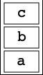

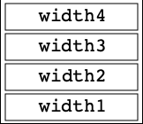

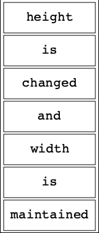


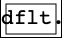

##### 例2
```
[x-dir.,in,the gap,changed
W100
X10
E
```

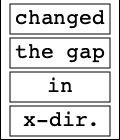

```
[y-dir.,in,the gap,changed
W100
Y10
E
```

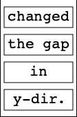

```
[line,thin,with,stack,and|line,thick,with,block
F10
L1
l3
Pb
Pr
E
```

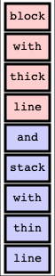

##### 例3

```
[stack,runs,horizontally
DH
W200
E
```


## 注意
### ファイル終端の`E`について

ファイル終端を表す行（行頭`E`）の指定は

必須ではありませんが、記述することを推奨します。

#### 解説

stackVisualizerでは、各行を解析する際に、

改行文字を削除するため、行末の1文字を一律除去しています。

したがって、ファイルの最後の行の末尾に改行をつけ忘れると、

ファイルの最後の行が正しく解釈されなくなる可能性があります。

ファイル終端を表す行を書くことで、

必然的にその直前の行までが改行文字で終わることが保証されるため、

この行の記述が推奨されています。

## ライセンス
BSD 3-Clause License ([LISENCE](LICENSE))参照

## 問合せ / Contact
Y-mos

E-mail:ymos.36e17a7047@gmail.com

